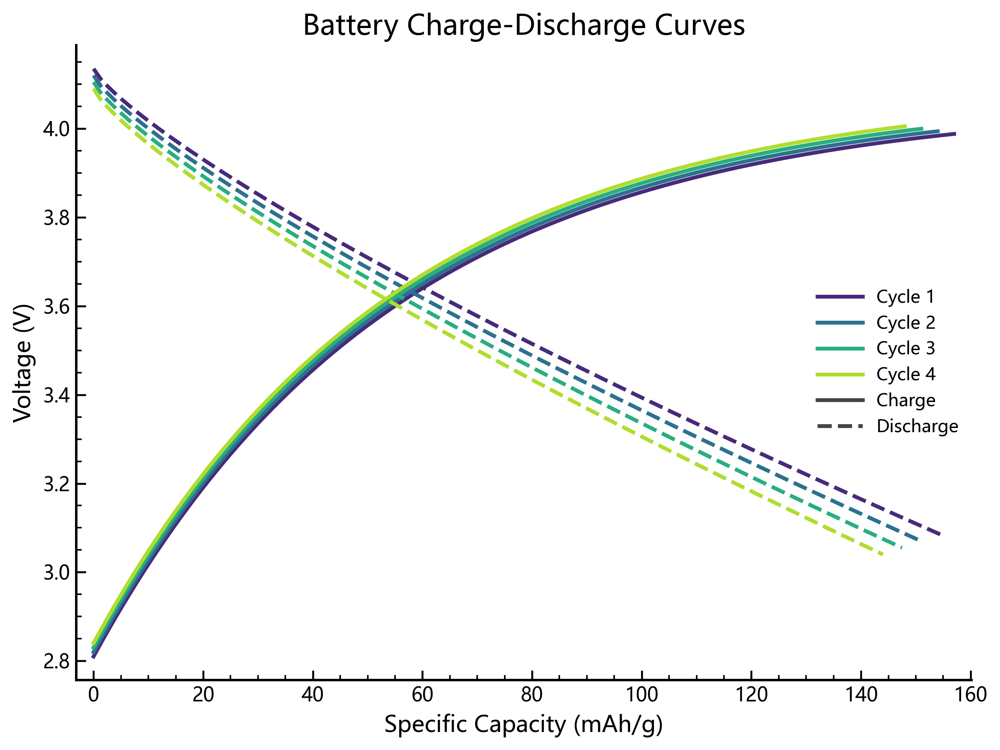
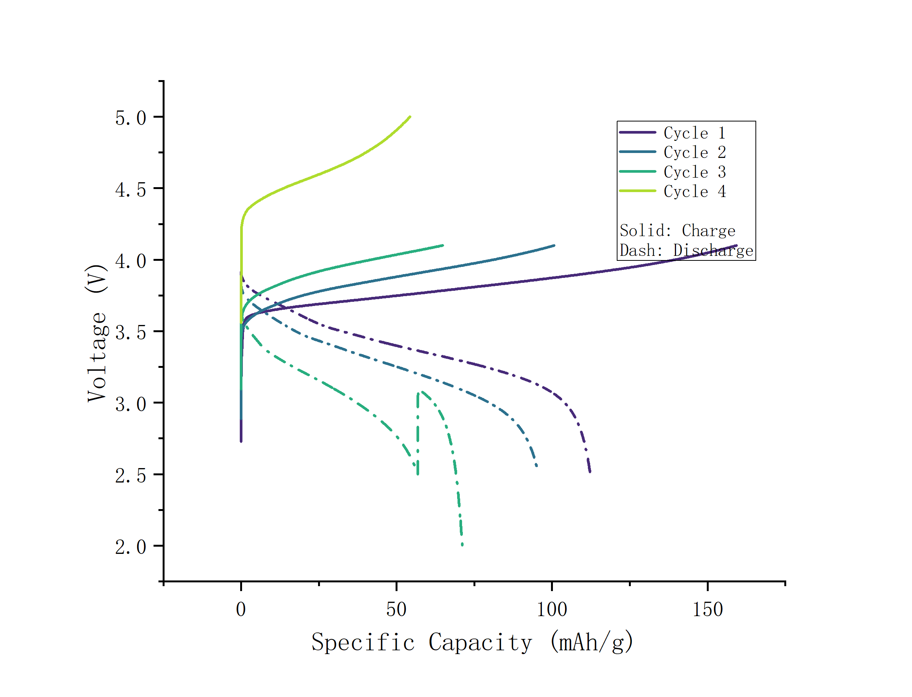

# Battery Voltage vs Specific Capacity Plotter

一个用于**电池/固态电池循环测试数据**的 Python 绘图工具。  
它可以从设备导出的 Excel 明细表中自动识别逐点数据，绘制 **Voltage vs Specific Capacity** 充放电曲线，并支持导出为图片或可编辑的 Origin 工程。

---

## 1. 当前版本亮点

当前版本已经支持：

- 命令行交互式运行
- GUI 图形界面运行
- `matplotlib` / `origin` 双后端
- 一个 Excel 中存在**多个子表格**时自动依次绘图
- 同一个 sheet 中存在**多个块状子表格**时自动拆分处理
- 从信息表中读取原始子表路径/文件名，并据此自动命名输出
- GUI 中选择 `colormap`，并支持**色卡预览**
- 使用 Origin 后端时同时保存**可编辑的 `.opju`**
- 更适合论文风格的作图样式：
  - 同一循环的充电/放电曲线使用**同一种颜色**
  - 不同循环之间按 `colormap` **渐变**
  - 图例更紧凑
  - 线条更清晰
  - 更接近常见高水平电池文章的基本风格
- 支持按需选择多种常见电化学图型：
  - `voltage_capacity`：GCD 充放电曲线
  - `long_cycling`：长循环性能 / 库仑效率
  - `rate_capability`：倍率性能
  - `dqdv`：dQ/dV 微分容量曲线
  - `dvdq`：dV/dQ 微分电压曲线

---

## 1.1 示例效果展示

下面是当前版本的实际输出示例。

### Matplotlib 后端示例



特点：

- 适合快速批量出图
- 同循环同色，不同循环渐变
- 图例紧凑，适合直接用于汇报和初步论文制图

### Origin 后端示例



特点：

- 支持输出图片同时保存 `.opju`
- 可以在 Origin 中继续编辑
- 默认样式已做过一轮美化，更适合后续精修

---

## 2. 快速开始

### 2.1 安装依赖

```powershell
python -m venv .venv
.\.venv\Scripts\activate
pip install -r requirements.txt
```

### 2.2 最推荐的使用方式

```powershell
python main.py
```

程序会一步一步提示你输入：

- Excel 文件路径
- sheet 名（可留空自动识别）
- 输出图片路径
- 循环范围
- 标题、图例等参数

### 2.3 图形界面运行

```powershell
python gui.py
```

或者：

```powershell
python main.py --gui
```

---

## 3. 适用数据

推荐输入：

- `.xlsx`
- `.xlsm`

当前更适合处理这类设备导出表：

- 前面有汇总区
- 后面才是真正的逐点数据
- 可能含多个 sheet
- 可能一个 sheet 中又拼接了多个子表格
- 工作模式列中充电/放电命名不统一

### 关于 `.ccs`

当前版本**不直接稳定解析 `.ccs` 原始文件**。  
建议先在设备软件中导出为 `.xlsx`，再使用本工具。

---

## 4. 自动识别能力

程序会尽量自动完成以下工作：

- 自动识别最可能的 sheet
- 自动识别表头所在行
- 自动识别关键列
- 自动区分 charge / discharge / rest
- 自动跳过静置数据
- 自动排序数据点
- 自动识别多个子表格
- 自动生成输出文件名

优先识别的常见列：

- `循环序号`
- `工作模式`
- `电压/V`
- `比容量/mAh/g`

兼容中英文常见列名变体。

---

## 5. 多子表格自动处理

如果一个 Excel 中包含多个子表格，程序会：

1. 依次读取每个子表格
2. 对每个子表格分别执行原有绘图流程
3. 分别输出对应图片

### 输出命名规则

如果信息表中存在类似原始路径：

```text
E:/HKUST-GZ/cyclingtest/2026.3.14-Gr_only_NMC0.788mg-CritCRate_20260314155506_DefaultGroup_37_1.ccs
```

则导出文件名会优先命名为：

```text
cyclingtest_2026.3.14-Gr_only_NMC0.788mg-CritCRate_20260314155506_DefaultGroup_37_1.png
```

如果没有识别到原始子表信息，则回退为类似：

```text
sheet名_part1.png
sheet名_part2.png
```

---

## 6. GUI 功能说明

GUI 中可以完成：

- 选择输入 Excel
- 选择输出目录
- 设置基础文件名
- 选择输出格式
- 选择绘图后端
- 设置循环编号
- 设置标题、坐标轴标题
- 设置 DPI、图尺寸、坐标范围
- 设置图例、网格、透明背景等选项
- 选择 `colormap`
- 预览色卡
- 选择是否保存 Origin 工程

### GUI 中两个常见参数

#### colormap

用于“按循环着色”时，不同循环自动取色的颜色方案。

推荐：

- `viridis`：默认推荐，渐变自然
- `plasma`：对比更强
- `tab10`：循环数较少时区分明显
- `cividis`：更克制稳重

#### 统一颜色

当你**关闭“按循环着色”**时，所有曲线使用同一个颜色。

---

## 7. 当前作图风格

### 7.1 默认风格

当前默认更偏向论文风格：

- 同循环 charge/discharge 同色
- charge 与 discharge 用不同线型区分
- 不同循环按 colormap 渐变
- 默认无网格
- 线条较之前更粗、更清晰
- 图例改为紧凑样式

### 7.2 Matplotlib 后端

适合：

- 快速出图
- 脚本批量处理
- 导出 `png/svg/pdf`

### 7.3 Origin 后端

适合：

- 想继续在 Origin 中手动微调
- 想输出**可编辑工程**

使用 Origin 后端时，可同时生成：

- 图片文件，如 `figure.png`
- Origin 工程文件，如 `figure.opju`

双击 `.opju` 后可以继续在 Origin 中修改：

- 图层
- 坐标轴
- 图例
- 线宽 / 线型 / 颜色
- 标题与标注

---

## 8. 命令行用法

### 最基本示例

```powershell
python main.py --input "D:\data\cell.xlsx" --output "D:\figures\curve.png"
```

### 选择绘图类型

```powershell
python main.py --input "D:\data\cell.xlsx" --output "D:\figures\curve.png" --plot-types voltage_capacity long_cycling dqdv
```

全部常用图一起输出：

```powershell
python main.py --input "D:\data\cell.xlsx" --output "D:\figures\curve.png" --plot-types all
```

### 指定循环

```powershell
python main.py --input "D:\data\cell.xlsx" --output "D:\figures\curve.png" --cycles 1 2 5-8
```

### 使用 Origin 后端

```powershell
python main.py --input "D:\data\cell.xlsx" --output "D:\figures\curve.png" --backend origin
```

### 图片 + 可编辑 Origin 工程

```powershell
python main.py --input "D:\data\cell.xlsx" --output "D:\figures\curve.png" --backend origin --save-origin-project
```

### 使用 GUI

```powershell
python main.py --gui
```

### 使用 demo 数据

```powershell
python main.py --demo --output demo.png
```

---

## 9. 常用参数

- `--input`：输入 Excel
- `--sheet`：指定 sheet
- `--output`：输出图片路径
- `--plot-types`：选择图型，可多选
- `--backend`：`matplotlib` / `origin`
- `--cycles`：循环范围
- `--dpi`：输出 DPI
- `--title`：标题
- `--x-label` / `--y-label`：坐标轴标题
- `--line-width`：线宽
- `--colormap`：颜色映射
- `--theme`：`paper` / `default`
- `--x-lim` / `--y-lim`：坐标范围
- `--show-legend` / `--no-show-legend`
- `--grid` / `--no-grid`
- `--color-by-cycle` / `--no-color-by-cycle`
- `--save-origin-project`

### 当前支持的图型

- `voltage_capacity`：Voltage vs Specific Capacity
- `long_cycling`：Charge / Discharge Capacity vs Cycle + Coulombic Efficiency
- `rate_capability`：Specific Capacity vs Cycle + Current Density
- `dqdv`：dQ/dV vs Voltage
- `dvdq`：dV/dQ vs Specific Capacity

说明：

- `long_cycling` 与 `rate_capability` 依赖循环汇总信息
- `dqdv` / `dvdq` 优先使用原表已有微分列；没有时会根据原始曲线自动估算
- 更常见的 `CV`、`Nyquist/EIS` 也属于电池文章高频图型，但通常需要**另一类实验数据文件**，当前这套 cycling Excel 不能稳定直接生成

---

## 10. 安装 Origin 后端依赖

如果你要调用本机 Origin：

```powershell
pip install originpro pywin32
```

前提：

- Windows
- 本机已安装 Origin
- Origin 的自动化接口可正常使用

---

## 11. 常见问题

### 11.1 为什么最后一圈没有放电曲线？

如果程序提示某一圈只检测到 charge、没有 discharge，通常说明：

- 源 Excel 中该圈的 discharge 数据本身不存在

也就是说这不一定是绘图漏了，而可能是原始数据就没有。

### 11.2 为什么 `.opju` 打开看起来空白？

当前版本已经修复：

- 工作簿隐藏
- 图页隐藏
- 保存后页面不可见

现在保存的 `.opju` 默认应包含：

- 可见的数据工作簿
- 可见的图页

### 11.3 GUI 里为什么有 colormap 和统一颜色两个选项？

- 开启“按循环着色” → 主要使用 `colormap`
- 关闭“按循环着色” → 主要使用“统一颜色”

---

## 12. 项目结构

```text
main.py            # 程序入口
gui.py             # GUI 图形界面
config.py          # 配置项
utils.py           # 输入与路径解析
parser.py          # 表头识别与字段映射
data_loader.py     # Excel 读取、多子表格识别
plotter.py         # matplotlib 绘图
origin_plotter.py  # Origin 绘图后端
README.md          # 项目说明
USER_MANUAL.md     # 用户手册
```

---

## 13. 推荐使用建议

如果你是第一次用：

1. 先运行 `python main.py`
2. 用默认交互式模式跑通一次
3. 再尝试 GUI
4. 最后根据需要切换到 Origin 后端

如果你经常处理同一种文件：

- 建议固定参数后改用命令行
- 或直接使用 GUI 保存一套常用习惯后重复操作

---

## 14. 补充

更详细的操作说明见：

- `USER_MANUAL.md`
